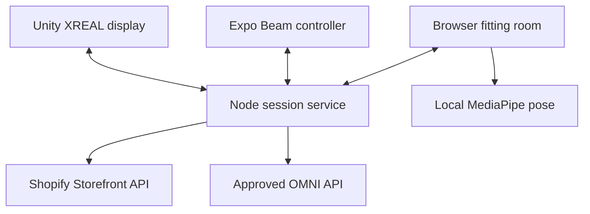

# Data and rendering contracts

Expo and Unity are separate Android apps. The browser is also a complete fitting-room client and optional camera/pose source. They share a session rather than embedding Unity inside React Native. This avoids adding a Unity-to-Expo native bridge to the hackathon's critical path.

## Session protocol

| Endpoint | Behavior |
|---|---|
| `GET /api/health` | Current modes and configured capability flags, no secrets |
| `GET /api/catalog` | Normalized product/variant data and material notes |
| `POST /api/sessions` | Create a random session capability |
| `GET /api/sessions/:id` | Current profile, product, variant, fit and assistant state |
| `GET /api/sessions/:id/events` | SSE updates for browser clients |
| `POST /api/sessions/:id/action` | Validated selection, size, favorite, wear, profile, alignment, pose or mode |
| `POST /api/sessions/:id/assistant` | Text, optional base64 JPEG/PNG and optional recorded audio |
| `POST /api/sessions/:id/checkout` | Create a cart for the selected available variant |
| `POST /api/sessions/:id/frame` | Opt-in in-memory JPEG plus capture-time pose; null clears it |
| `GET /api/sessions/:id/frame` | JPEG and matching pose in `X-Clothee-Frame-Pose`; HTTP 204 if absent/expired |
| `DELETE /api/sessions/:id` | Revoke session, close listeners and discard state/media |

Every ordinary state mutation increments `revision`. Clients discard older snapshots. User actions are serialized per client. An assistant result merges onto the newest state so a slow response cannot undo later navigation. Suggestions never alter the selected product until the user applies them.

## Camera placement

Coordinates are normalized in the original camera frame: `x` increases to the right, `y` downward. The browser places video and garment within the same aspect-preserving rectangle, and mirrors the entire rectangle once. The pose result itself is not mirrored. Body landmarks must have visibility at least 0.55.

For a top, shoulder width determines garment width; shoulder-to-hip distance determines height. Rotation uses an ordered left-to-right image-space shoulder pair. This avoids the 180-degree flip caused by treating MediaPipe's anatomical left as screen left. A small temporal smoothing factor reduces jitter. The algorithm is deliberately simple and does not infer measurement units, material stretch, cloth dynamics, depth or occlusion.

Accessories use coarse head/shoulder/foot anchors. Shoes are a single two-shoe illustration. The frame rate, shape and anchoring limits should be described honestly during a demonstration.

Unity uses the pose captured alongside each relayed camera frame, rather than a newer unrelated pose update. This avoids moving the garment against a stale picture while the low-rate relay catches up.

## Environmental data

Composition and specific claims come from catalog metadata, not the model's memory. The backend only accepts sourcing/manufacturing/wage/ethics claims with a source URL, and always marks them merchant-reported. That requirement confirms a source was supplied; it does not prove the source's accuracy. A real verification workflow would need review, versioned provenance and scope checks.

Carbon needs a stated system boundary. Do not compare a cradle-to-gate value to a full lifecycle value as if they were equivalent. The sample numbers are made-up interface fixtures. The code includes a separate shipping scenario function:

`kg CO2e = (parcel mass in kg / 1000) × distance in km × kg CO2e per tonne-km × (1 + return fraction)`

The return fraction assumes a same-distance, same-mode return leg. The user must supply the parcel mass, route, mode-appropriate factor and return assumption. This is a scenario, not a measured product footprint. It excludes packaging production, manufacturing, use, warehousing and disposal unless those are independently modelled elsewhere.

## Scaling beyond the demo

The current catalog is loaded once at server start; restart to refresh it. Sessions are capped and held in process memory. Public deployment needs persistent accounts/storage, authenticated device pairing, horizontal session coordination, product update handling, telemetry without media retention, and a documented consent/provider policy. Those concerns are distinct from getting the hackathon's end-to-end interaction working.
